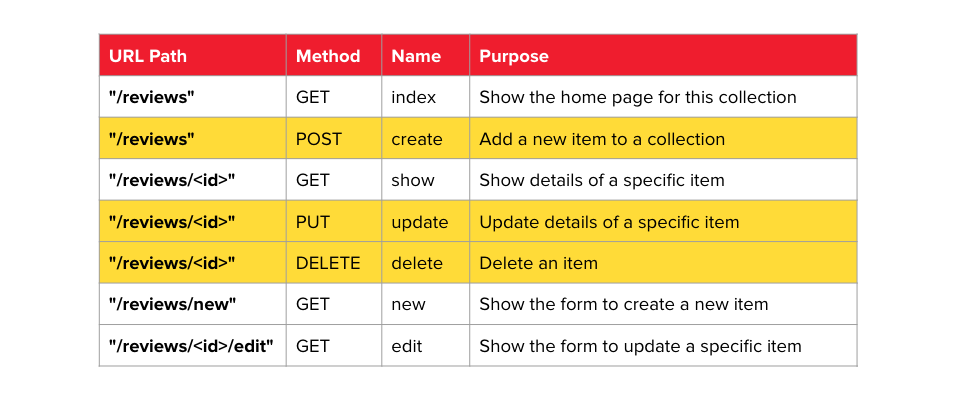
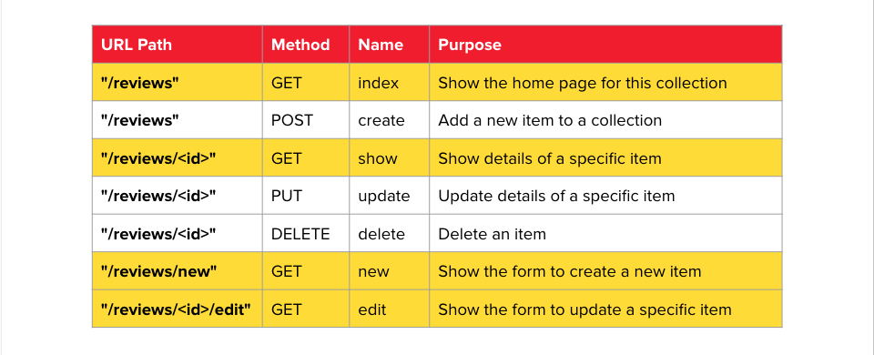

<h1>
  Flask Templates
  Flask: Web Applications vs APIs
</h1>

**Learning objective:** By the end of this lesson, learners will be able to differentiate between using Flask for building database-backed APIs and for rendering web applications with dynamic templates, as well as understand the basic CRUD operations and how they map to RESTful routes in Flask.

| Lesson                          | Duration |
| ------------------------------- | -------- |
| Flask: Web Applications vs APIs | 10 min   |

## Our Learning Goals

- Use Flask to render html and templates
- Use programming logic in templates to conditionally or programmatically render data
- Explore sending and receiving more data

## Two Paths for Flask Applications

There are two primary ways you can use Flask: as a database-backed API or as a web application that renders templates.

| **Database-Backed APIs**                                                                                                                                                                                                   | **Web Apps Rendering Templates**                                                                                                                                                                                                                  |
| -------------------------------------------------------------------------------------------------------------------------------------------------------------------------------------------------------------------------- | ------------------------------------------------------------------------------------------------------------------------------------------------------------------------------------------------------------------------------------------------- |
| Flask can be connected to databases using Python libraries, such as SQLAlchemy. This allows your Flask app to manage and store persistent data.                                                                            | Flask can be used to power web applications that generate dynamic HTML content.                                                                                                                                                                   |
| By attaching a database to your Flask app, you can create APIs that allow users to interact with and manage resources. These APIs can serve data from various sources, like databases or files (e.g., CSVs), to end users. | With the help of a templating library like [Jinja](https://jinja.palletsprojects.com/en/3.1.x/), Flask can "fill in the blanks" on specific pages with data from your Flask app. This allows you to create interactive and data-driven web pages. |
| While interacting with databases is beyond the scope of this course, we can use mock data sets hardcoded into our server to build and test our API code.                                                                   | Flask can create routes that serve static HTML pages (pages that don't change) and dynamic templates (pages with injected data). You can have as many routes as you need to serve different pages in your web app.                                |

> Fun fact it can even do both!

## Understanding Routes: Data Operations vs. Content Delivery

When working with APIs, you'll often hear the term **CRUD**. CRUD stands for **Create**, **Read**, **Update**, and **Delete**—the four basic operations that you can perform on data. When building APIs, these operations are mapped to specific HTTP methods through RESTful routes.

### What is CRUD?

- **Create**: This operation adds new data to the server. For example, when you sign up for a new account on a website, you are creating a new user record.
- **Read**: This operation retrieves data from the server. For instance, when you log in and view your profile, the website reads your user data to display it.
- **Update**: This operation modifies existing data. If you change your profile picture, you're updating your user record.
- **Delete**: This operation removes data from the server. For example, deleting a post you've made on a social media platform removes that record.

### CRUD Operations and RESTful Routes

In a RESTful API, these CRUD operations are carried out through specific HTTP methods and routes:

| **CRUD Operation** | **HTTP Method** | **Description**                                                                                       | **Example**                                            |
| ------------------ | --------------- | ----------------------------------------------------------------------------------------------------- | ------------------------------------------------------ |
| **Create**         | POST            | Add a new resource to the server.                                                                     | `POST /reviews`                                        |
| **Read**           | GET             | Retrieve data from the server.   Use it to fetch a list of resources or a specific resource by ID. | `GET /reviews` (index)   `GET /reviews/<id>` (show) |
| **Update**         | PUT             | Modify an existing resource.                                                                          | `PUT /reviews/<id>`                                    |
| **Delete**         | DELETE          | Remove a specific resource.                                                                           | `DELETE /reviews/<id>`                                 |

### Create, Update, Delete - Routes used for Data Manipulation

The `C`, `U` and `D` routes do not have web pages tied to them and are for data manipulation only.

### Read - Routes for Serving Information

When building a web application with Flask, some routes are specifically designed to deliver data or HTML content. These routes usually correspond to pages that users interact with, such as forms, dashboards, or content displays.

> Notice these are all `GET` routes that can be requested by the browser.

### Serving HTML Pages with Flask

- **Static Pages**: Routes that serve static HTML content, such as an `about` or `contact` page, don’t change based on user interaction. For example, `GET /about` might serve a simple HTML page with information about your site.

- **Template-Based Pages**: When using Flask with a templating engine like [Jinja](https://jinja.palletsprojects.com/en/3.1.x/), these routes can inject dynamic content into HTML templates. This allows your application to generate pages that are customized based on user input or other data, but the primary goal is to present content rather than manipulate data.

> Note: In this context, the focus is on delivering HTML content to users. While these routes may interact with data, their primary purpose is to render and serve web pages.
