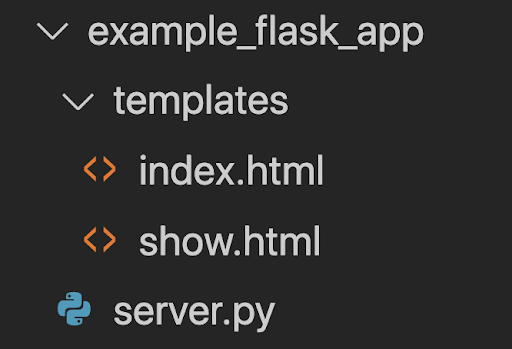
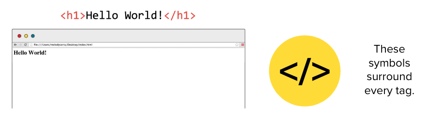
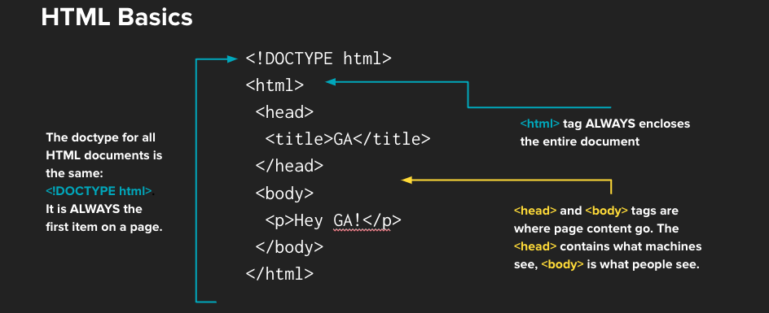

<h1>
  <span class="headline">Flask Templates</span>
  <span class="subhead">Rendering HTML Templates</span>
</h1>

**Learning objective:** By the end of this lesson, learners will be able to render HTML templates using Flask, inject dynamic data into templates with Jinja syntax, and set up a template-based structure for serving web pages in a Flask application.

| Lesson                   | Duration |
| ------------------------ | -------- |
| Rendering HTML Templates | 40 min   |

## Sending Plain HTML Back to the Browser

Before we dive into using templates, let's start with something simple: sending plain HTML directly from your Flask routes.

In Flask, you can return a string containing HTML tags, and Flask will send it as a response to the client's browser. This is useful for small, straightforward pages or when you want to test a quick output without creating a full HTML file.

<br>

<div class="activity guided-walkthrough">
  <h2 class="title">Rendering HTML in Flask</h2>
  <span class="minutes">5 min</span>
</div>

Lets take a look at an example:

```python
@app.route("/hello")
def hello_world():
    return "<h1>Hello, World!</h1>"
```

In this code, when a user visits the `/hello` route, Flask sends back the string `"<h1>Hello, World!</h1>"` as the response. The browser then renders this string as an HTML header on the page.

While this approach is handy for quick and simple outputs, it's not ideal for more complex pages.

## Setting up Templates in Flask

Even though Python is not a front-end technology, we can still use a Flask app to collect and send HTML files to user's browsers in a web application.
Wherever your Flask application file lives, we'll need a folder named templates that's accessible at the same level as the main server file.



## What are Templates?

Templates are HTML documents that take advantage of a templating library to use fill-in-the-blank variables. [Jinja](https://jinja.palletsprojects.com/en/3.1.x/), the templating library provided by Flask as a default, uses double curly braces to set apart template variables.

### Template Syntax

```html
<p>Flask is {{adjective}}</p>
```

## Rendering Templates

Flask provides us with a built in `render_template()` function to render HTML template files. The first argument for this function is the html file we want to render. By default, Flask will start by looking in the folder named **templates**.

Here's what a route rendering a template file looks like:

```python
@app.route("/example")
def example_route():
    return render_template("example.html", adjective="fun")
```

We can also provide keyword arguments in order to _inject_ variable values into the template for rendering. This is how we can fill in the blanks of our templates!

```html
<h1>Hello from Flask!</h1>
<p>Flask is {{adjective}}</p>
```

The user will see:

```plaintext
Hello from Flask!
Flask is fun
```

<br>

<div class="activity guided-walkthrough">
  <h2 class="title">Rendering Templates in Flask</h2>
  <span class="minutes">15 min</span>
</div>

To get up and running with templates, let's start up the example Flask server provided and visit [`localhost:5000/example`](localhost:5000/example) to see the template rendering in action.

We can also experiment with changing the value of the keyword arguments and adding more variables to the template.

## Rendering a Template with Data

Now we'll learn how to take an existing HTML template and use Flask to insert dynamic data into it. This allows us to create web pages that display information from our application, such as book reviews.

Suppose we have the following data :

```python
# Mock Data
reviews = [
    {"book_title": "The Little Prince",
     "review_text": "A profound and poetic tale about life, love, and human nature.", "score": 5, "id": "1"},
    {"book_title": "The Alchemist",
     "review_text": "A magical story about following your dreams and listening to your heart.", "score": 5, "id": "2"},
    {"book_title": "The Kite Runner",
     "review_text": "A powerful story of friendship, betrayal, and redemption.", "score": 4, "id": "3"},
]
```


And we want to make a `show` page that just displays one of the items in this list.

```html
<!DOCTYPE html>
<html lang="en">
  <head>
    <meta charset="UTF-8" />
    <meta http-equiv="X-UA-Compatible" content="IE=edge" />
    <meta name="viewport" content="width=device-width, initial-scale=1.0" />
    <title>Show Page</title>
  </head>
  <body>
    <!-- Put details of the review here -->
  </body>
</html>
```

We know that we can target the first review in this list with:

```python
reviews[0]

# {"book_title": "The Little Prince", "review_text": "A profound and poetic tale about life, love, and human nature.", "score": 5, "id": "1"}
```

We can also _pass this object as a variable_ to a template in a `show` route.

<br>

<div class="activity partner-exercise">
  <h2 class="title">Create a <code>show</code> route</h2>
  <span class="minutes">15 min</span>
</div>

Let's create the route for showing a specific review in our reviews app.

Since this route leads to a specific item, we'll need a _route parameter_ to tell us which review the user wants. We'll need to include this parameter in how we define the **route url** and as an **argument** to the route handler function.


## HTML Crash Course!

Before we dive deeper into Flask templates, it’s important to have a basic understanding of HTML, which is the language used to structure content on the web. If you’re new to HTML, don’t worry—this crash course will teach you just enough to get started.

### What is HTML?

HTML (HyperText Markup Language) is the standard language for creating web pages. It consists of a series of elements that describe the structure and content of a webpage.



### Basic HTML Structure

Here’s what a simple HTML document looks like:

```html
<!DOCTYPE html>
<html lang="en">
  <head>
    <meta charset="UTF-8" />
    <meta name="viewport" content="width=device-width, initial-scale=1.0" />
    <title>My First Webpage</title>
  </head>
  <body>
    <h1>Hello, World!</h1>
    <p>This is a paragraph of text on my webpage.</p>
  </body>
</html>
```



### Document Elements

- `<!DOCTYPE html>`: Declares the document type and version of HTML.
- `<html>`: The root element that wraps all content on the page.
- `<head>`: Contains meta-information about the document, like the title and character set.
- `<title>`: Sets the title of the page, which appears in the browser tab.

### Common HTML Elements

| **Element**    | **Description**                                                                                  | **Example**                                                                                                                                                                                                                                                                                   |
| -------------- | ------------------------------------------------------------------------------------------------ | --------------------------------------------------------------------------------------------------------------------------------------------------------------------------------------------------------------------------------------------------------------------------------------------- |
| **Headings**   | Used to create titles or subtitles, ranging from `<h1>` (largest) to `<h6>` (smallest).          | `<h1>This is a Heading</h1>`<br>`<h2>This is a Subheading</h2>`                                                                                                                                                                                                                               |
| **Paragraphs** | Defines a paragraph of text.                                                                     | `<p>This is a paragraph of text.</p>`                                                                                                                                                                                                                                                         |
| **Links**      | Creates hyperlinks, with the `href` attribute specifying the URL.                                | `<a href="https://www.example.com">Visit Example.com</a>`                                                                                                                                                                                                                                     |
| **Images**     | Displays images, with the `src` attribute specifying the path to the image file.                 | ``                                                                                                                                                                                                                                        |
| **Lists**      | Ordered (`<ol>`) and unordered (`<ul>`) lists, with each list item wrapped in an `<li>` element. | `<ul>`<br>&nbsp;&nbsp;&nbsp;`<li>Item 1</li>`<br>&nbsp;&nbsp;&nbsp;`<li>Item 2</li>`<br>&nbsp;&nbsp;&nbsp;`<li>Item 3</li>`<br>`</ul>`<br>`<ol>`<br>&nbsp;&nbsp;&nbsp;`<li>First item</li>`<br>&nbsp;&nbsp;&nbsp;`<li>Second item</li>`<br>&nbsp;&nbsp;&nbsp;`<li>Third item</li>`<br>`</ol>` |
